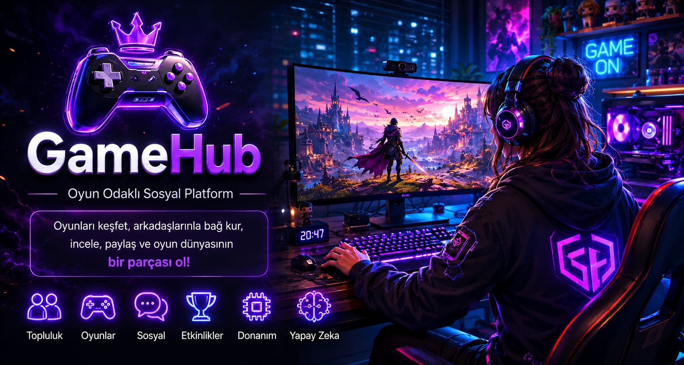
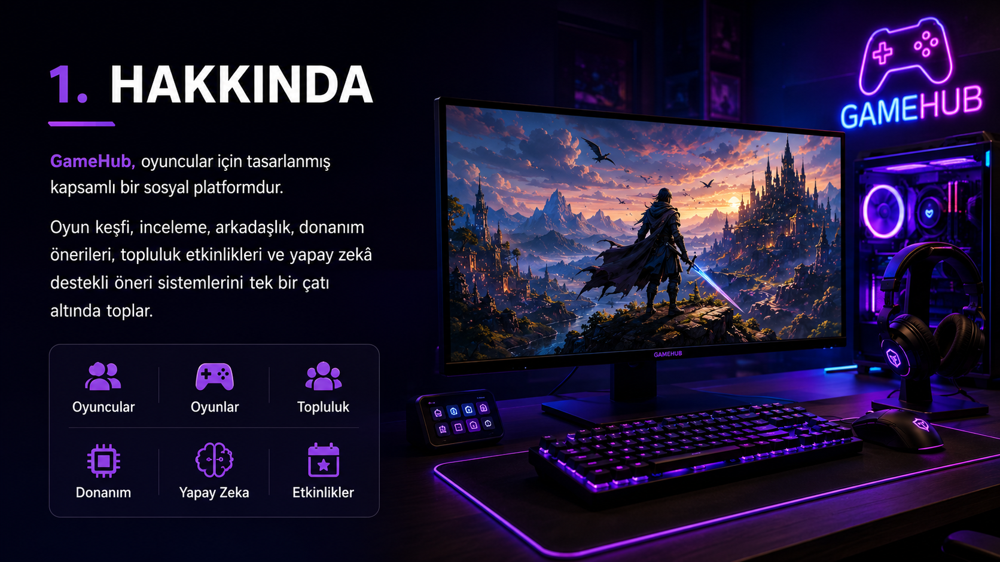
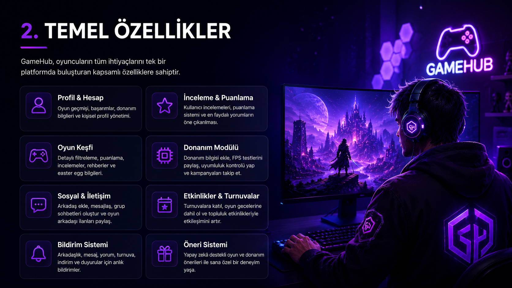
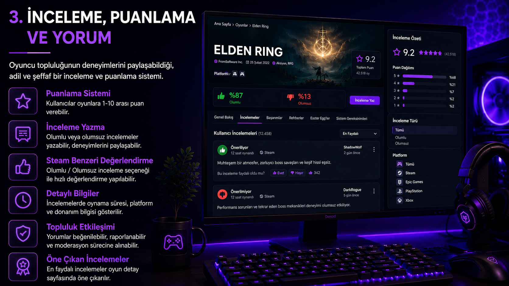
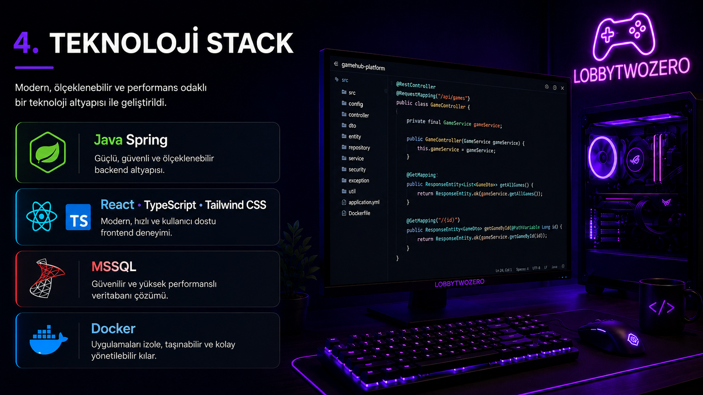
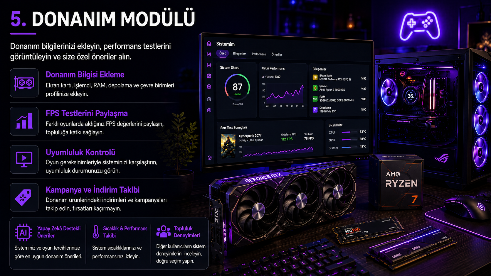
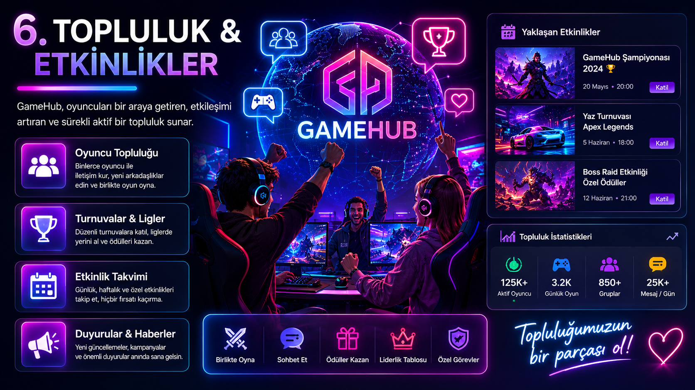
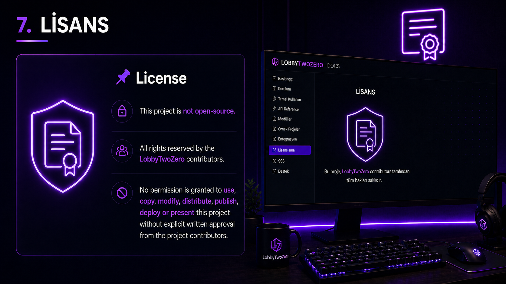

# 🎮 LobbyTwoZero

LobbyTwoZero, oyuncuları tek bir platformda buluşturan; oyun keşfi, sosyal etkileşim, inceleme, donanım önerileri ve topluluk etkinliklerini bir araya getiren modern bir oyun odaklı sosyal platform projesidir.

  

---

## 📌 About LobbyTwoZero

LobbyTwoZero, oyuncuları tek bir platformda buluşturan oyun odaklı sosyal bir ekosistemdir. Kullanıcılar oyun keşfedebilir, arkadaşlarıyla bağlantı kurabilir, oyun geçmişlerini paylaşabilir, topluluklara katılabilir ve kişiselleştirilmiş öneriler alabilir.

  

---

## ✨ Core Features

Platform; profil yönetimi, oyun keşfi, inceleme ve puanlama, sosyal iletişim, bildirim sistemi, donanım modülü ve öneri sistemi gibi temel özellikleri bir arada sunar. Böylece oyuncular ihtiyaç duydukları birçok işlemi tek merkezden yönetebilir.

  

---

## ⭐ Review, Rating & Comments

Kullanıcılar oyunlara puan verebilir, olumlu veya olumsuz inceleme yazabilir ve deneyimlerini toplulukla paylaşabilir. En faydalı incelemeler öne çıkarılarak oyun seçim süreci daha güvenilir ve kullanıcı odaklı hale getirilir.

  

---

## 🛠️ Technology Stack

Projenin backend tarafında Java Spring, frontend tarafında React, TypeScript ve Tailwind CSS kullanılacaktır. Veritabanı olarak MSSQL tercih edilirken, uygulamanın daha kolay taşınabilir ve yönetilebilir olması için Docker container yapısı desteklenecektir.

  

---

## 💻 Hardware Module

Kullanıcılar ekran kartı, işlemci, RAM, depolama ve çevre birimi gibi donanım bilgilerini profillerine ekleyebilir. Bu bilgiler sayesinde oyun performansı, uyumluluk, FPS deneyimleri ve kişiye özel donanım önerileri sunulabilir.

  

---

## 👥 Community & Events

LobbyTwoZero, oyuncuların topluluklara katılmasını, oyun geceleri düzenlemesini, turnuvalara dahil olmasını ve diğer oyuncularla etkileşim kurmasını sağlar. Etkinlik takvimi, duyurular, rozetler ve grup yapılarıyla platform içi bağlılık artırılır.

  

---

## 📌 License

This project is not open-source.

All rights reserved by the LobbyTwoZero contributors.
No permission is granted to use, copy, modify, distribute, publish, deploy or present this project without explicit written approval from the project contributors.

  

